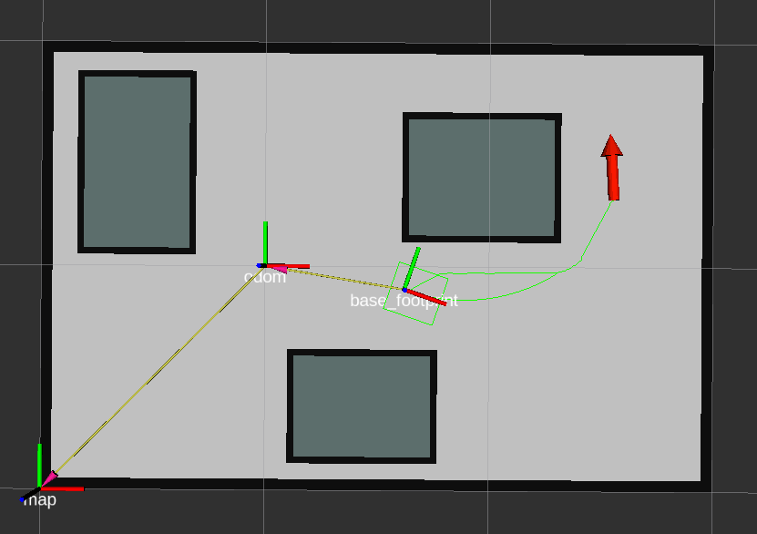

# Sujet 9 - Galileo ROS

**Projet de majeure Robotique** en *5ème Année* à l'école [CPE Lyon](https://www.cpe.fr/).

**Auteur :** Xavier Jannin

## Présentation du projet

**Objectif :** Implémenter [`ROS`](https://www.ros.org/) sur un robot constituer uniquement de *moteurs* et d'*encodeurs*.

**Matériels utilisés :**
- *Petit robot à roues différentielles*, avec des *encodeurs fixés* sur des *roues touchant le sol*.
- [NUCLEO-STM32F411RE](https://www.st.com/en/evaluation-tools/nucleo-f411re.html) : intéragit avec la partie électronique (moteurs et encodeurs).
- [Raspberry Pi 3 Model B](https://www.raspberrypi.org/products/raspberry-pi-3-model-b/) : exécute *ROS* et permet le contrôle du robot.


## Structure

Pour respecter une *commande en vitesse* `/cmd_vel`, le [`DiffDriveController`](./ROS/robot_hardware) génère des commandes en vitesse pour les *moteurs* du robots.

Les *encodeurs* permettent de connaître la position des roues et de vérifier que les commandes sont correctement réalisées.

Les positions et vitesses sont renvoyées au [`DiffDriveController`](./ROS/src/robot_hardware) pour déterminer l'odométrie `/odom`.

```mermaid
graph LR
    subgraph STM32
        VelocityJoints
        rosserial
    end

    subgraph Raspberry
        DiffDriveController
    end

    /cmd_vel --> DiffDriveController -. /joints_command .-> rosserial
    rosserial -. /joints_data .-> DiffDriveController

    VelocityJoints -- PWM --> Moteurs(Moteurs) -.- Encodeurs([Encodeurs])
    Encodeurs -- ticks --> VelocityJoints

    DiffDriveController --> /odom
```

En complément, la *Raspberry* implémente des outils de [**navigation**](./ROS/src/robot_navigation) pour générer des *commandes en vitesse* pour que le robot se déplace à une position demandée.
Ces outils sont aussi capable d'éviter des obstacles en connaissant la carte dans laquelle se déplace le robot :




## Fonctionnalités

Liste des fonctionnalités réalisées et/ou souhaitées pour ce projet :

**[ROS](./ROS/src) :**
- **Contrôle du robot :**
  - [x] **`DiffDriveController` :** réalise l'**odométrie** + génère des **commandes** pour chaque moteur à partir d'une *commande en vitesse*.
  - [x] **`hardware_interface` :** communication entre la `STM32` et le `DiffDriveController`.
  - [x] **Envoyer de commandes en vitesse** avec le *clavier* ou la *souris*.
  - [x] **Visualisation des déplacements** sur `RViz`.
- **Navigation :**
  - [x] Intégration de la **Navigation Stack** de *ROS*.
  - [x] **Génération du chemin** (avec évitement d'obstacles) pour aller vers la *position demandée* grâce à une **carte**.
  - [x] **Génération des commandes** pour déplacer le robot vers une *position demandée*.
  - [ ] **Déplacement** sans rencontrer d'obstacles.
  - [ ] **Génération d'une carte** à partir de *capteurs* ([*SLAM*](http://wiki.ros.org/gmapping)).
  - [ ] **Utilisation de capteurs** (*lidar*, ...) pour **positionner** le robot sur la carte ([*AMCL*](http://wiki.ros.org/amcl)).

**[STM32](./STM32) :**
- [x] **`Encoder` :** classe pour récupérer la position d'un *encodeur*.
- [x] **`Motor` :** classe pour alimenter un *moteur*.
- [x] **`PID` :** classe pour réaliser un *PID*.
- [x] **`VelocityJoint` :** classe pour contrôler un moteur en vitesse grâce à un *encodeur* et un *PID*.
- [x] **`rosserial` :** communication avec *ROS* pour envoyer et recevoir des données.
    - [x] : Envoie les **informations** des moteurs (*position* et *vitesse*).
    - [x] : Récupère les **commandes en vitesse** du `DiffDriveController` pour les moteurs.
    - [x] : *Topics* pour **récupérer les informations** des *encodeurs*.
    - [x] : *Topics* pour **modifier directement** les valeurs des *PIDs*.


## Vidéos de présentation

- Vidéo du [Pitch](https://youtu.be/VJsIVI4iNSg).
- Vidéo du [Tutoriel](https://youtu.be/sGky4Ky0h-s).


## Eléments à installer

Pour faire fonctionner ce projet, il est nécessaire d'avoir les éléments suivants installés :

**Partie STM32 :**
- [`STM32CubeIDE`](https://www.st.com/en/development-tools/stm32cubeide.html) : *IDE* pour compiler et téléverser le programme sur la *STM32*.

**Partie Raspberry :**
- Installation de l'image de [`Ubiquity Robotics`](https://downloads.ubiquityrobotics.com/pi.html) qui a toute la configuration pour *ROS* et fonctionne directement en *hotspot Wifi*.

**Partie *ROS* :**
- [*ROS*](http://wiki.ros.org/melodic/Installation/Ubuntu) (à partir de la version `Kinetic`).
- Les *package* suivants pour que la partie *ROS* puisse compiler et fonctionner :
  - [`ros_control`](http://wiki.ros.org/ros_control)
  - [`ros_controllers`](http://wiki.ros.org/ros_controllers)
  - [`rosserial`](http://wiki.ros.org/rosserial)
  - [`navigation`](http://wiki.ros.org/navigation)
  - [`teleop_keyboard`](http://wiki.ros.org/teleop_twist_keyboard)
  - [`key_teleop`](http://wiki.ros.org/key_teleop)
  - [`mouse_teleop`](https://github.com/ros-teleop/teleop_tools/tree/kinetic-devel/mouse_teleop)
  - [`twist_mux`](http://wiki.ros.org/twist_mux)

Si la compilation ne fonctionne pas, essayer d'installer quelques *packages* supplémentaires :
- [`velocity_controllers`](http://wiki.ros.org/robot_mechanism_controllers/JointVelocityController)
- [`ros_melodic_four_wheel_steering_controller`](http://wiki.ros.org/four_wheel_steering_controller) (peut-être optionnel)


**Note :**

Commande pour installer un package :
```sh
$ sudo apt-get install ros-<distro>-<package-name>
```
Avec :
- `<distro>` : nom de la distribution *ROS* utilisée (`melodic`, `kinetic`).
- `<package-name>` : nom du package avec les `_` remplacer par des `-` (`mouse_teleop` → `mouse-teleop`).


## Procédure de mise en route

Sur un ordinateur, exécuter les actions suivantes pour démarrer les outils principaux du projet : `DiffDriveController`, `Navigation` et *contrôle avec la souris*.

**Avec le robot :**
- Utiliser `STM32CubeIDE` pour téléverser le programme contenu dans le dossier [*STM32*](./STM32) sur la `STM32`.
- Allumer la *Raspberry* et brancher la `STM32` dessus.
- Se connecter sur le *WiFi* de la *Raspberry* : `ubiquityrobotXXXX`
- Se connecter au *Master ROS* de la *Raspberry* :
  ```sh
  export ROS_MASTER_URI=http://10.42.0.1:11311
  ```
- Compiler et sourcer le *projet ROS* sur l'ordinateur et la *Raspberry*, en étant dans le dossier [*ROS*](./ROS) :
  ```sh
  $ catkin_make
  $ source devel/setup.bash
  ```
- Lancer le *launch file* `robot_bringup.launch` du package `robot_bringup` depuis l'ordinateur pour démarrer le projet :
  ```sh
  $ roslaunch robot_bringup robot_bringup.launch
  ```

**Sans le robot, en simulation :**
- Compiler et sourcer le *projet ROS*, en étant dans le dossier [*ROS*](./ROS) :
  ```sh
  $ catkin_make
  $ source devel/setup.bash
  ```
- Lancer le *launch file* `simulation.launch` du package `robot_bringup` pour démarrer le projet :
  ```sh
  $ roslaunch robot_bringup simulation_bringup.launch
  ```

Dans les deux cas, `RViz` s'ouvre pour **visualiser les déplacements** du robot.

Une autre fenêtre s'est aussi ouverte pour permettre l'**envoie de commandes en vitesse** au robot et le voir se déplacer sur `RViz` (et aussi dans la réalité).

Enfin, l'outil `2D Nav Goal` de `RViz` permet de donner une **position sur la carte**, et le robot essaye d'y aller de manière **autonome**.
